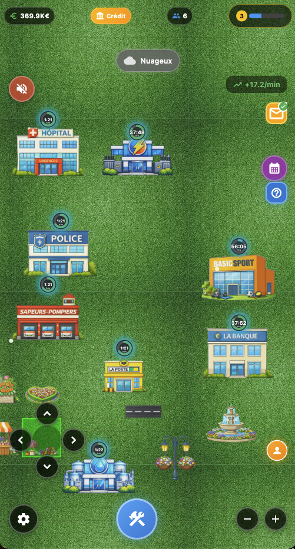

# Yougosse_millionaire

A Yougosse millionaire game where you can build and manage your city.

### ID: com.yougossemillionaire.yougossemillionaire

<table>
    <tr>
        <td>  </td>
        <td>  </td>
    </tr>
</table>

## Getting Started

This project is a starting point for a Flutter application.

## Installation

Yougosse_millionaire requires Flutter to run.

## Mode du jeu

Le jeu est en mode solo.
Yougosse_millionaire est un jeu de gestion de ville.

Qui permet de gagner de l'argent en construisant des bâtiments et en les améliorant.


# Stack

- Flutter
- Dart
- Firebase

# Features

- Sound
- Music
- Ads
- Save game
- Building placement
- Daily greeting

# Context fonctionnel

Tu es un expert Flutter + Firebase specialise dans les jeux mobile 2D de type city builder.

## CONTEXTE DU JEU : YOUGOSSE MILLIONNAIRE

Je developpe un jeu mobile 2D de type city builder avec les fonctionnalites suivantes :

### RESSOURCES JOUEUR
- **Argent (Money)** : Monnaie principale (depart: 500€)
- **Gemmes (Gems)** : Monnaie premium (depart: 50)
- **XP** : Points d'experience (10 XP/batiment, 100 XP/niveau)
- **Niveau** : Calcule depuis les XP cumules
- **Systeme de credit bancaire** : 1000€ - 10000€, remboursement 500€/jour

### SYSTEME DE BATIMENTS (60+ types)
- **Residentiels** (26) : Maisons (500€ - 8000€), Immeubles (100K€ - 5M€)
- **Commerciaux** (9) : Boutiques → Mega Centre (1000€ - 40000€)
- **Industriels/Activites** (8) : Gare, Poste, Banque, Police, Hopital, Pompiers, Electricite, Eau
- **Decorations** (6) : Jardins, Parcs, Fontaines (bonus bonheur)
- **Monuments** (8) : Tour Eiffel, Arc de Triomphe, Big Ben, Statue Liberte, etc.
- **Infrastructure** (8) : Routes et terrains

### PROPRIETES DES BATIMENTS
- Grille 140x140 cellules
- Cout, population, temps construction, revenus par cycle
- Cycles de revenus : 30min - 480min
- Placement, deplacement (long-press), demolition
- Progression de construction avec timer

### SYSTEME ECONOMIQUE
- Revenus par cycle collectables manuellement
- Multiplicateur de bonheur (0.5x - 2.0x)
- Revenus hors-ligne (max 24h)
- Calcul ROI dynamique

### SYSTEME DE BONHEUR
- Base: 0.5, max: 2.0
- Bonus des batiments (decorations, monuments)
- Ratio decorations/autres batiments
- Affecte les revenus collectes

### SYSTEME METEO
- 5 types : Ensoleille (40%), Nuageux (25%), Pluie (20%), Neige (15%), Nuit
- Temperature dynamique (-5°C a 34°C)
- Cycle jour/nuit (5 min reelles = 1 jour jeu)
- Intensite variable, effets visuels (particules pluie/neige)

### OBJECTIFS HEBDOMADAIRES
- 5 objectifs aleatoires par semaine
- Types : Collecter argent, Construire, Population, Bonheur
- Recompenses en argent
- Systeme d'enveloppe (ouvert/non-ouvert)

### OBJECTIFS MENSUELS (Campagne)
- Mois 1-2 : Objectifs debutant/intermediaire
- Mois 3+ : Scaling exponentiel (x2/mois)
- 6 types : Construction, Population, Revenus, Categorie, Bonheur, Amelioration
- Recompenses : Argent + XP

### BOUTIQUE PREMIUM
- 8 packs de monuments (Legendaire, Epique, Rare, Commun)
- Prix en gemmes (100-750) ou argent (100K-500K)
- Editions limitees
- Offres de gemmes (0.99€ - 49.99€)

### SYSTEME AUDIO
- Musique de fond
- Effets sonores (caisse, construction, niveau)
- Volumes configurables (0-100%)

### PERSONNAGES NPC
- 3 personnages : Nora, Christine, James
- Message quotidien personnalise
- Conseils bases sur progression

### UI/OVERLAYS
- HUD principal (argent, gemmes, niveau, population, bonheur)
- Menu construction (6 categories)
- Info batiment (stats, actions)
- Boutique (packs, gemmes)
- Parametres (nom ville, audio, stats)
- Objectifs (hebdo/mensuel)
- Meteo
- Regles du jeu

  ---                                                                                                                                                       

## STACK IMPOSEE

- Flutter (Dart)
- Firebase Auth (Email + Google + Apple)
- Cloud Firestore
- Firebase Storage
- Hive (cache local existant)

  ---                                                                                                                                                       

## EXIGENCES FONCTIONNELLES

### 1. Authentification
- Connexion / inscription (Email, Google, Apple)
- Session persistante
- Mode invite avec migration vers compte complet
- Recuperation mot de passe

### 2. Modele de donnees Firestore

users/{userId}                                                                                                                                            
├── email                                                                                                                                                 
├── displayName                                                                                                                                           
├── createdAt                                                                                                                                             
├── lastLoginAt                                                                                                                                           
├── totalPlayTime                                                                                                                                         
├── achievements[]                                                                                                                                        
│                                                                                                                                                         
└── games/{gameId}                                                                                                                                        
├── gameId                                                                                                                                            
├── name (nom de la partie)                                                                                                                           
├── createdAt                                                                                                                                         
├── updatedAt                                                                                                                                         
├── version (version du jeu)                                                                                                                          
├── timestampAntiRollback                                                                                                                             
│                                                                                                                                                     
├── player                                                                                                                                            
│   ├── money                                                                                                                                         
│   ├── gems                                                                                                                                          
│   ├── xp                                                                                                                                            
│   ├── totalMoneyEarned                                                                                                                              
│   ├── buildingsPlaced                                                                                                                               
│   ├── lastSessionTime                                                                                                                               
│   ├── hasTakenCredit                                                                                                                                
│   ├── creditAmount                                                                                                                                  
│   ├── lastCreditPaymentDate                                                                                                                         
│   ├── dailyRevenueTracker                                                                                                                           
│   ├── lastDailyRevenue                                                                                                                              
│   └── lastRevenueResetDate                                                                                                                          
│                                                                                                                                                     
├── city                                                                                                                                              
│   ├── buildings[] (id, type, x, y, constructedAt, lastCollected)                                                                                    
│   └── gridSize                                                                                                                                      
│                                                                                                                                                     
├── cityName                                                                                                                                          
│                                                                                                                                                     
├── objectives                                                                                                                                        
│   ├── weekly (objectives[], startDate, isOpened)                                                                                                    
│   └── monthly (month, objectives[], startDate, endDate)                                                                                             
│                                                                                                                                                     
├── shop                                                                                                                                              
│   ├── purchasedPacks[]                                                                                                                              
│   └── packPurchaseCounts{}                                                                                                                          
│                                                                                                                                                     
└── settings                                                                                                                                          
├── musicVolume                                                                                                                                   
├── sfxVolume                                                                                                                                     
└── isMusicEnabled

### 3. Firebase Storage
- Screenshots de parties (optionnel)
- Backups comprimes pour grosses maps
- Lien stocke dans Firestore

### 4. Offline First
- Cache local Hive (existant) + sync Firestore
- Detection connectivite
- Queue des operations offline
- Sync auto au retour reseau
- Resolution conflits : timestamp anti-rollback + last write wins

### 5. Regles de securite Firestore
- Acces uniquement aux donnees du user connecte
- Validation des champs obligatoires
- Limite de taille des documents
- Rate limiting basique

### 6. Services a implementer

  ```dart                                                                                                                                                   
  // Services requis                                                                                                                                        
  - AuthService : connexion, deconnexion, session, migration invite                                                                                         
  - CloudSaveService : CRUD parties cloud                                                                                                                   
  - SyncService : synchronisation Hive <-> Firestore                                                                                                        
  - ConnectivityService : detection reseau                                                                                                                  
                                                                                                                                                            
  7. Fonctionnalites de sauvegarde                                                                                                                          
                                                                                                                                                            
  - Creer nouvelle partie                                                                                                                                   
  - Sauvegarder partie (auto toutes les 30s + manuel)                                                                                                       
  - Charger liste des parties                                                                                                                               
  - Charger une partie specifique                                                                                                                           
  - Supprimer une partie                                                                                                                                    
  - Renommer une partie                                                                                                                                     
  - Dupliquer une partie                                                                                                                                    
  - Exporter/Importer partie (JSON)                                                                                                                         
                                                                                                                                                            
  ---                                                                                                                                                       
  CONTRAINTES                                                                                                                                               
                                                                                                                                                            
  - Code clair, commente en francais                                                                                                                        
  - Pas de pseudo-code, code pret a integrer                                                                                                                
  - Compatible avec structure existante (lib/models, lib/services, lib/game)                                                                                
  - Utiliser les modeles existants (PlayerModel, CityModel, GameState)                                                                                      
  - Pas d'UI complexe (juste logique metier)                                                                                                                
  - Gestion d'erreurs robuste                                                                                                                               
  - Logs pour debug                                                                                                                                         
                                                                                                                                                            
  ---                                                                                                                                                       
  OBJECTIF FINAL                                                                                                                                            
                                                                                                                                                            
  Avoir un systeme de sauvegarde cloud robuste, scalable et securise permettant :                                                                           
  - Multi-parties par utilisateur                                                                                                                           
  - Jeu sur plusieurs appareils                                                                                                                             
  - Continuite apres desinstallation                                                                                                                        
  - Mode offline fonctionnel                                                                                                                                
  - Sync transparente                                                                                                                                       
                                                                                                                                                            
  ---                                                                                                                                                       
  LIVRAISONS ATTENDUES                                                                                                                                      
                                                                                                                                                            
  1. Architecture : Schema et explication du flow                                                                                                           
  2. Modeles Dart : UserModel, CloudGameSaveModel (adaptes aux existants)                                                                                   
  3. Services : AuthService, CloudSaveService, SyncService                                                                                                  
  4. Regles Firestore : Fichier complet                                                                                                                     
  5. Integration : Exemple d'utilisation dans le jeu existant                                                                                               
  6. Migration : Comment migrer les sauvegardes Hive existantes vers Firestore                                                                              
                                                                                                                                                            
  Commence par expliquer l'architecture, puis fournis le code etape par etape.                                                                              
                                                                                                                                                            
  ---                                                                                                                                                       
                                                                                                                                                            
  Ce prompt inclut toutes les fonctionnalites de ton jeu et permet a un expert de comprendre exactement ce qu'il doit implementer pour le systeme cloud.


# Author

- Jonathan
